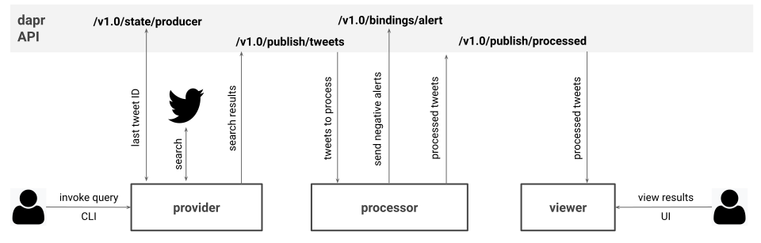

# dapr-pipeline

Example of Twitter event processing pipeline using dapr framework.



> I built this pipeline as a way of learning dapr. Please, do open an issue if you find a bug or where I'm not following the best practices. You can find my notes from this experience [here](./NOTES.md).

## What does it do

This pipeline consists of three services:

### producer

Exposes query API (`/query`) to which users can post their Twitter queries (e.g. `serverless AND dapr`). These queries are used then to search Twitter API, and after filtering out re-tweets (RT), the matching tweet text along with a small part of meta-data as converted into a generic content payload (e.g. id, author, created on, text) and published to the `tweets` topic (`/v1.0/publish/tweets`). To avoid duplication, the `producer` services persists the last ID from each search result in `dapr` state service (`/v1.0/state/producer`) to use it as the `since_id` in subsequent Twitter API queries.

### processor

Subscribes to the `tweets` topic using (`/dapr/subscribe`) service and scores the sentiment of each submitted event using simple probabalistic model (the model was trained on IMDB movie reviews so it's not always most accurate but fine for this demo). All scored content is then published to `processed` topic (`/v1.0/publish/processed`) while the negative content is sent also to an external alerting service configured in `dapr` as an HTTP binding (`/v1.0/bindings/alert`).

### viewer

Subscribes to the `processed` topic using (`/dapr/subscribe`) service and stream all received events into a WebSocket connection created by the UI application which displays the content on the dashboard.

> This pipeline uses a [godapr](https://github.com/mchmarny/godapr) HTTP client library which hides all the `dapr` specific logic


## How do I run it

### Prerequisites

#### dapr

To run this demo locally, you will have to have install [dapr](https://github.com) along with all its dependencies (e.g. Docker). The dapr project describes itself as "An event-driven, portable runtime for building microservices". The instructions for how to do that can be found [here](https://github.com/dapr/docs/blob/master/getting-started/environment-setup.md).

#### Twitter

To query Twitter API you will also need the consumer key and secret. You can get these by registering a Twitter application [here](https://developer.twitter.com/en/apps/create).

### Setup

Assuming you have all the prerequisites mentioned above you can demo this dapr pipeline in following steps. First, start by cloning this repo:

```shell
git clone https://github.com/mchmarny/dapr-pipeline.git
```

and then navigate into the `dapr-pipeline` directory:

```shell
cd dapr-pipeline
```

and build the executables for your OS

```shell
bin/build
```

> Note, if you don't have `go` you can download the pre-built executables for Mac, Windows or Linux from the [latest release](https://github.com/mchmarny/dapr-pipeline/releases/latest).

### Starting pipeline

This pipeline consists of three microservices: Provider, Processor, and Viewer. In the `dapr-pipeline` directory follow these instructions on launching each one of these services:

#### Provider

Before starting the `provider`, you will need to export your Twitter API consumer and access keys (see the [Prerequisites](#prerequisites) section for details).

```shell
export TW_CONSUMER_KEY="..."
export TW_CONSUMER_SECRET="..."
export TW_ACCESS_TOKEN="..."
export TW_ACCESS_SECRET="..."
```

Once the Twitter API consumer and access details are set, you are ready to run the `provider`:

> For environments other than mac you will have to append the OS name to the executable to each one of the `run` commands (e.g. for Linux `bin/producer-linux` and for Windows `bin/producer-windows`)

```shell
dapr run bin/producer \
         --app-id producer \
         --app-port 8081 \
         --protocol http \
         --max-concurrency 1 \
         --port 3500
```

Assuming everything went OK, you should see something like this:

```shell
ℹ️  Updating metadata for app command: bin/producer
✅  You're up and running! Both Dapr and your app logs will appear here.
```

#### Processor

To run the `processor`, in a another terminal window execute but still in the `dapr-pipeline` directory run:

```shell
dapr run bin/processor \
         --app-id processor \
         --app-port 8082 \
         --protocol http
```

Again, if everything goes well, you will see:

```shell
ℹ️  Updating metadata for app command: bin/processor
✅  You're up and running! Both Dapr and your app logs will appear here.
```

#### Viewer

Finally, once `provider` and `processor` are running, you are ready to run `viewer`. In yet another terminal window run:

```shell
dapr run bin/viewer \
         --app-id viewer \
         --app-port 8083 \
         --protocol http
```

Just like with the previous two, you will see this on successful start:

```shell
ℹ️  Updating metadata for app command: bin/viewer
✅  You're up and running! Both Dapr and your app logs will appear here.
```

### Dashboard

Once all three microservices are running, you can launch the `viewer` dashboard by navigating in your browser to http://localhost:8083/


> Note, the model used to score these tweets is basic. It was trained on IMDB movie reviews and it's used here purely for demo purposes.

Once we submit queries, you will see each tweet with its sentiment scored listed here. The icon left of the tweet author's username will indicate the sentiment (positive  and negative ). The Twitter logo, right of the username, can will provide a link to the original tweet on https://twitter.com.

## How do I submit a query

Finally, to trigger the pipeline you will need to submit query. At minimum, the query payload requires `query` which is search term you want to execute (e.g. `serverless`). This can also be a complex query with `AND` or `OR` operators (e.g. `serverless OR dapr BUT NOT faas`). Also, since the NLP model can only score English text, we are going to provide a language filter (`en`). Here is our demo query, feel free to edit it to your needs.

```json
{ "query": "serverless OR faas OR dapr", "lang": "en" }
```

To submit the query we will use `curl` to `POST` this payload to the `producer` query API:

```shell
curl -d '{ "query": "serverless OR faas OR dapr", "lang": "en" }' \
     -H "Content-type: application/json" \
     "http://localhost:3500/v1.0/invoke/producer/method/query"
```

The result should look something like this

```json
{
  "since_id": 0,
  "max_id": 1250171486037594113,
  "query": "serverless+OR+faas+OR+dapr",
  "query_key": "qk-5bc2219226dfe1c2a020891735d571a4",
  "items_found": 100,
  "items_published": 83,
  "search_duration": 0.1
}
```

This being the first query, the `since_id` will be `0`. The `max_id` is the last tweet ID which will become the `since_id` on the next query. The `items_published` will be lower than `items_found` because the provider filters out re-tweets (RT).

Hope you found this demo helpful. You can find my notes I captured during building this demo [here](./NOTES.md).

## Disclaimer

This is my personal project and it does not represent my employer. I take no responsibility for issues caused by this code. I do my best to ensure that everything works, but if something goes wrong, my apologies is all you will get.

## License
This software is released under the [Apache v2 License](./LICENSE)


