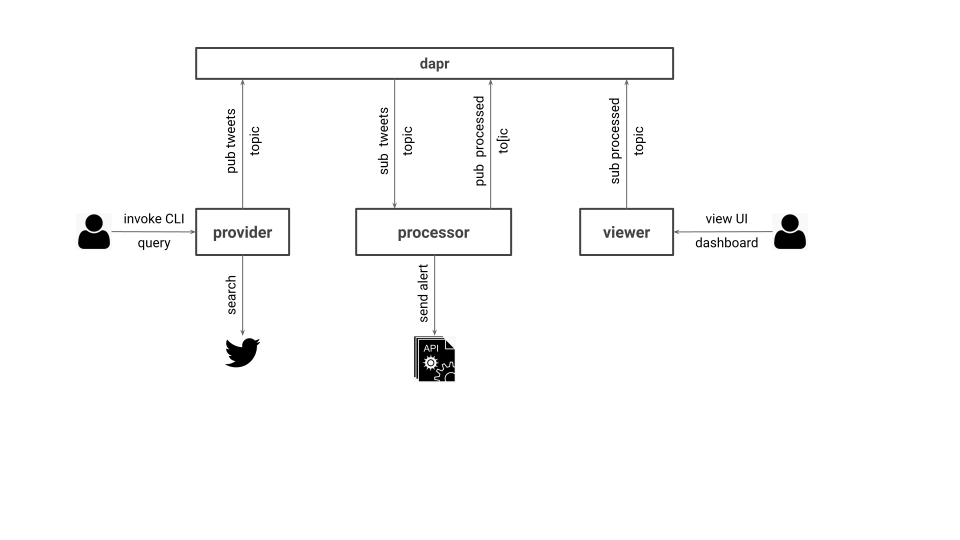
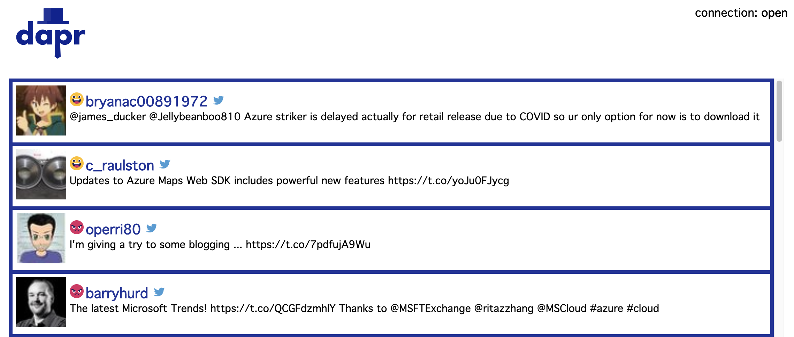

# dapr-pipeline

Example of Twitter event processing pipeline using dapr framework



## What does it do

This pipeline exposes query API through which users can submit Twitter search requests. Each tweet matching that query is then analyzed for sentiment using a very simple probabalistic model and published to UI dashboard for viewing. Tweets considered to be negative are sent to an external alert API.

## Prerequisites

### dapr

To run this demo locally, you will have to have install [dapr](https://github.com) along with all its dependencies (e.g. Docker). The dapr project describes itself as "An event-driven, portable runtime for building microservices". The instructions for how to do that can be found [here](https://github.com/dapr/docs/blob/master/getting-started/environment-setup.md).

### Twitter

To query Twitter API you will also need the consumer key and secret. You can get these by registering a Twitter application [here](https://developer.twitter.com/en/apps/create).

## How to demo it

Assuming you have all the prerequisites mentioned above you can demo this dapr pipeline in following steps.

> For ease of replication and brevity of this document I created simple commands located in the `bin` directory in each project. Both, for security reasons and to learn how execute the complete command, you should review these before executing scripts.

This pipeline comprises three microservices: Provider, Processor, and Viewer. Successfully ran, each microservice will return this message:

```shell
ℹ️  Updating metadata for app command: go run search.go handler.go main.go
✅  You're up and running! Both Dapr and your app logs will appear here.
```

### Provider

First, you will need to export your Twitter consumer keys obtained in [Prerequisites](#prerequisites) section

```shell
export TW_CONSUMER_KEY="..."
export TW_CONSUMER_SECRET="..."
```

Once set, you are ready to run the provider. `cd` into the `producer` directory and execute `bin/run` command

```shell
cd producer
bin/run
```

### Processor

To run the Processor, in a different terminal window, `cd` into the `processor` directory and execute `bin/run` command

```shell
cd processor
bin/run
```

### Viewer

To run the Viewer, in a yet different terminal window, simply `cd` into the `viewer` directory and execute `bin/run` command

```shell
cd viewer
bin/run
```

### Query

Once all three microservices are running, you are ready to submit query. The query payload is defined by:

* `text` - search term you want to execute (e.g. `serverless`). This can be a complex query with `AND` or `OR` operators (e.g. `serverless OR dapr BUT NOT faas`)
* `user` - twitter username to whom the query credentials belong
* `token` and `secret` - are the consumer API keys. This allows the same pipeline to be used for multiple users with different credentials and API query limits

```json
{
    "text": "serverless OR dapr",
    "user": "dapr",
    "token": "A9***************whrb",
    "secret": "4v**********************GNB0"
}
```

Once your query file is ready (e.g. `producer/query/demo-query.json`), switch back to the `producer` directory in a yet another terminal window and execute `bin/invoke`command.

```shell
cd producer
bin/invoke
```

Alternatively, you can submit query using the `curl`

curl -d "@path/to/user/query.json" \
     -H "Content-type: application/json" \
     "http://localhost:${DAPR_HTTP_PORT}/v1.0/invoke/provider/method/query"
```

The result should look something like this

```json
{
  "since_id": 0,
  "max_id": 1249755795732017200,
  "query": "serverless OR azure",
  "items_found": 100,
  "items_published": 54,
  "search_duration": 0.088
}
```

### UI

To view the final results (where each tweet's sentiment is scored), navigate to http://localhost:8083/ (make sure the viewer service is still running). The UI should look like this



The face, left to the tweet author username, is the indication of the sentiment, positive  and negative . The Twitter logo, right of the username, is the link to the specific tweet in the threat on https://twitter.com.

> Note, the model used to score these tweets is basic. It was trained on IMDB movie reviews and it's used here purely for demo purposes.

## Disclaimer

This is my personal project and it does not represent my employer. I take no responsibility for issues caused by this code. I do my best to ensure that everything works, but if something goes wrong, my apologies is all you will get.

## License
This software is released under the [Apache v2 License](./LICENSE)


