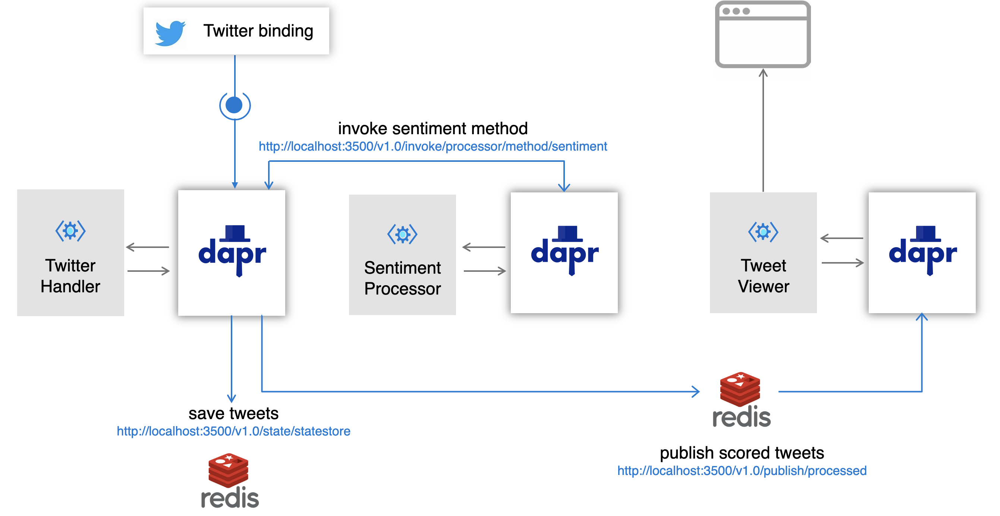
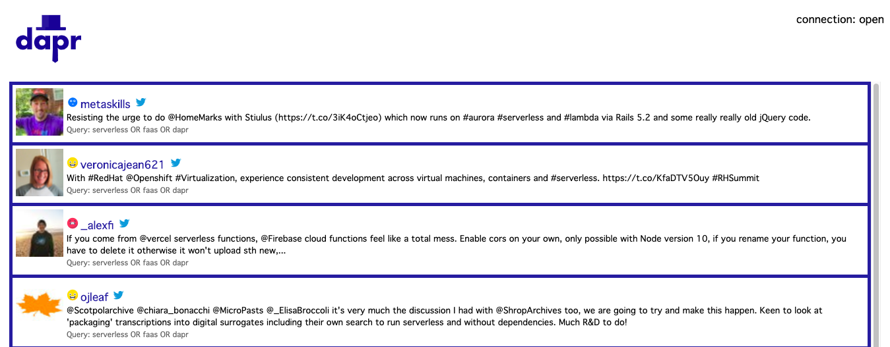

# dapr-pipeline

Example of Twitter event processing pipeline using dapr framework.



> This readme covers local deployment. For Kubernetes deployment instructions [see here](./deployment/)

## Prerequisites

### Dapr

To run this demo locally, you will have to install [Dapr](https://github.com).

### Twitter

To use the Dapr twitter binding you will also need Twitter API consumer keys and secrets. You can get these by registering your Twitter application [here](https://developer.twitter.com/en/apps/create).

### Cognitive Services

To analyze sentiment of each text, you will also need an API token for the Azure [Cognitive Services](https://azure.microsoft.com/en-us/services/cognitive-services/). You can learn more about the API and how to configure it [here](https://docs.microsoft.com/en-us/azure/cognitive-services/text-analytics/how-tos/text-analytics-how-to-sentiment-analysis?tabs=version-2#sentiment-analysis-versions-and-features).

## Setup

Assuming you have all the prerequisites mentioned above you can demo this dapr pipeline in following steps. First, start by cloning this repo:

```shell
git clone https://github.com/mchmarny/dapr-pipeline.git
```

and then navigate into the `dapr-pipeline` directory:

```shell
cd dapr-pipeline
```

and build the executables for your OS

```shell
bin/build
```

> Note, if you don't have `go` you can download the pre-built executables for Mac, Windows or Linux from the [latest release](https://github.com/mchmarny/dapr-pipeline/releases/latest).

## Run

This pipeline consists of three microservices: Processor, Sentimenter, and Viewer. Still inside of the the `dapr-pipeline` you cloned above, follow these instructions to launching each one of these services:

### Sentimenter

To starting `sentimenter`, first export your Azure Cognitive Services API key (see the [Prerequisites](#prerequisites) section for details).

```shell
export CS_TOKEN="<your key here>"
```

And then launch it using Dapr:

```shell
dapr run dist/sentimenter --app-id sentimenter --app-port 8082 --protocol http
```

If everything goes well when launch these services using Dapr you will see following message:

```shell
ℹ️  Updating metadata for app command: bin/sentimenter
✅  You're up and running! Both Dapr and your app logs will appear here.
```

### Viewer

Next, start `viewer`. In yet another terminal window navigate to the `dapr-pipeline` directory and run:

```shell
dapr run dist/viewer --app-id viewer --app-port 8083 --protocol http
```

While there still won't be any data, at this point you should be able to navigate to the viewer UI

http://localhost:8083/


### Processor

Finally, to start the `processor`, first edit the Dapt [Twitter input binding component](components/twitter.yaml) using the Twitter API secrets your created in [Prerequisites](#prerequisites)):

```yaml
apiVersion: dapr.io/v1alpha1
kind: Component
metadata:
  name: tweets
spec:
  type: bindings.twitter
  metadata:
  - name: consumerKey
    value: ""
  - name: consumerSecret
    value: ""
  - name: accessToken
    value: ""
  - name: accessSecret
    value: ""
  - name: query
    value: "serverless"  
```

> For demo purposes use a search term that appears often on Twitter (e.g. serverless)

Once the Twitter API secrets are set, you are ready to run the `processor`:

```shell
dapr run dist/processor --app-id processor --app-port 8081 --protocol http --port 3500
```

### Dashboard

Once all three microservices are running, you can go back to the `viewer` (http://localhost:8083/). After a few moments you should see something like this:

  

The icon left of the tweet author's username indicates the sentiment (positive , negative , or neutral ). The Twitter logo right of the username is also linked to the original tweet on https://twitter.com.

> YOu can find how-to on deployment this demo on Kubernetes [here](./deployment/)

## Disclaimer

This is my personal project and it does not represent my employer. I take no responsibility for issues caused by this code. I do my best to ensure that everything works, but if something goes wrong, my apologies is all you will get.

## License
This software is released under the [Apache v2 License](./LICENSE)


