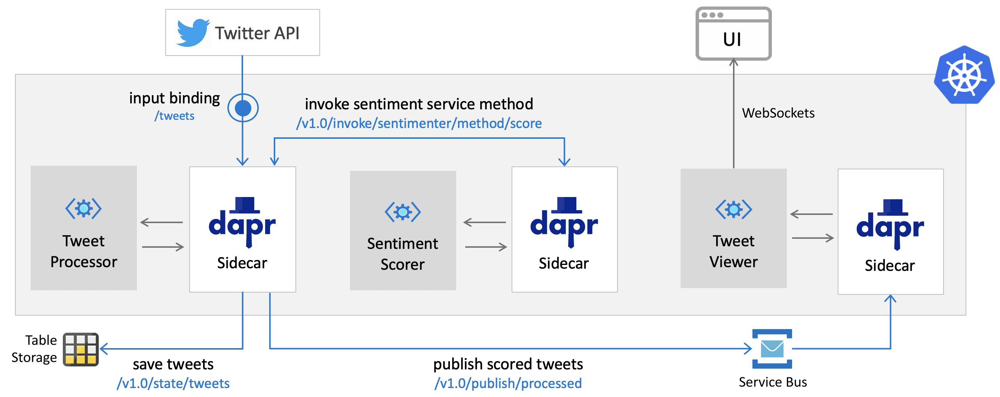

# Kubernetes Deployment

This document will overview the `dapr-pipeline` demo deployment into Kubernetes. For illustration purposes, all commands in this document will be based on Microsoft Azure. 



Dapr supports a wide array of state and pubsub backing services across multiple Cloud and on-prem deployments, so if you already have a Kubernates cluster somewhere else, you can substitute:

* [state backing service options](https://github.com/dapr/docs/tree/master/howto/setup-state-store)
* [pubsub backing service options](https://github.com/dapr/docs/tree/master/howto/setup-pub-sub-message-broker) 

## Prerequisite

* [Azure CLI](https://docs.microsoft.com/en-us/cli/azure/install-azure-cli?view=azure-cli-latest)

Also, to simplify all the scripts in this doc, set a few `az` CLI defaults:

```shell
az account set --subscription <id or name>
az configure --defaults location=<prefered location> group=<your resource group>
```

## Cluster (optional)

If you don't already have Kubernates cluster, you can create it on Azure with all the necessary add-ons for this demo usign tihs command:

```shell
az aks create --name demo \
              --kubernetes-version 1.15.10 \
              --enable-managed-identity \
              --vm-set-type VirtualMachineScaleSets \
              --node-vm-size Standard_F4s_v2 \
              --enable-addons monitoring,http_application_routing \
              --generate-ssh-keys
```

## Install dapr

See instructions how to install dapr into your Kubernetes cluster [here](https://github.com/dapr/docs/blob/master/getting-started/environment-setup.md#installing-dapr-on-a-kubernetes-cluster)

## Component-backing services 

Assuming you have a Kubernates cluster and `kubectl` CLI configure to connect you are ready to setup the `dapr` components and their backing services:

> This demo installs into the `default` namespace in your cluster. When installing into a different namespace, make sure to append the `-n <your namespace name>` to all commands below (secret, component, and deployment) 

### State

To configure `dapr` state component in this demo I will use Azure Table Storage. To set it up, follow [these instructions](https://docs.microsoft.com/en-us/azure/storage/common/storage-account-create?tabs=azure-portal). Once finished, you will need to configure also the Kubernates secrets to hold the Azure Table Storage account information:

```shell
kubectl create secret generic demo-state-secret \
  --from-literal=account-name='' \
  --from-literal=account-key=''
```

Once the secret is configured, deploy the `dapr` state component:

```shell
kubectl apply -f component/state.yaml
```

### PubSub

To configure `dapr` pubsub component in this demo I will use Azure Service Bus. To set it up, follow [these instructions](https://docs.microsoft.com/en-us/azure/service-bus-messaging/service-bus-quickstart-topics-subscriptions-portal). Once finished, you will need to configure the Kubernates secret to hold Azure Service Bus connection string information. 


```shell
kubectl create secret generic demo-pubsub-secret \
  --from-literal=connection-string=''
```

Once the secret is configured, deploy the `dapr` pubsub topic components:

```shell
kubectl apply -f component/pubsub.yaml
```

### Twitter Input Binding  

Finally, to use the Dapr Twitter input binding we need to configure the Twitter API secretes. You can get these by registering Twitter application and obtain this information [here](https://developer.twitter.com/en/apps/create).

```shell
kubectl create secret generic demo-twitter-secrets \
  --from-literal=access-secret="" \
  --from-literal=access-token="" \
  --from-literal=consumer-key="" \
  --from-literal=consumer-secret=""
```

Once the secret is configured you can deploy the Twitter binding:

```shell
kubectl apply -f component/twitter.yaml
```

## Deploying Demo 

Once the necessary components are created, you just need to create one more secret for the Cognitive Service token that is used in the `processor` service: 

```shell
kubectl create secret generic demo-sentimenter-secret \
  --from-literal=token=""
```

And now you can deploy the entire pipeline (`provider`, `processor`, `viewer`) with a single command:

```shell
kubectl apply -f sentimenter.yaml -f viewer.yaml -f processor.yaml
```

You can check on the status of your deployment like this: 

```shell
kubectl get pods -l env=demo
```

The results should look similar to this (make sure each pod has READY status 2/2)

```shell
NAME                           READY   STATUS    RESTARTS   AGE
processor-89666d54b-hkd5t      2/2     Running   0          18s
sentimenter-85cfbf5456-lc85g   2/2     Running   0          18s
viewer-76448d65fb-bm2dc        2/2     Running   0          18s
```

### Exposing viewer UI

To expose the viewer application externally, create Kubernetes `service` using [deployment/service/viewer.yaml](deployment/service/viewer.yaml)

```shell
kubectl apply -f service/viewer.yaml
```

> Note, the provisioning of External IP may take up to 1-2 min 

To view the viewer application by capturing the load balancer public IP and opening it in the browser:

```shell
export VIEWER_IP=$(kubectl get svc viewer --output 'jsonpath={.status.loadBalancer.ingress[0].ip}')
open "http://${VIEWER_IP}/"
```

> To change the Twitter topic query, first edit the [deployment/component/twitter.yaml](deployment/component/twitter.yaml), then apply it (`kubectl apply -f component/twitter.yaml`), and finally, restart the processor (`kubectl rollout restart deployment processor`) to ensure the new configuration is applied. 


## Observability 

### Azure 

You can view the scored tweets in Azure table storage 


Similarly you can monitor the pubsub topic throughout in Azure Service Bus 


### OSS

In addition, you can also observe Dapr metrics, logs, and traces for this demo. 

#### Metrics in Grafana dashboard 

> Instructions on how to setup Grafana for Dapr are [here](https://github.com/dapr/docs/blob/master/howto/setup-monitoring-tools/setup-prometheus-grafana.md)

Forward port

http://localhost:8080/


#### Logs in Kibana dashboard 

> Instructions on how to setup Kibana for Dapr are [here](https://github.com/dapr/docs/blob/master/howto/setup-monitoring-tools/setup-fluentd-es-kibana.md)


http://localhost:5601/

#### Traces in Zipkin dashboard 

> Instructions on how to setup Zipkin for Dapr are [here](https://github.com/dapr/docs/blob/master/howto/diagnose-with-tracing/zipkin.md)


http://localhost:9411/zipkin/

> Note, if your Zipkin isn't deployed in the `default` namespace you will have to edit the `exporterAddress` in [deployment/tracing/zipkin.yaml](deployment/tracing/zipkin.yaml)


Then just restart all the deployments 

```shell
kubectl rollout restart deployment processor sentimenter  viewer
```


